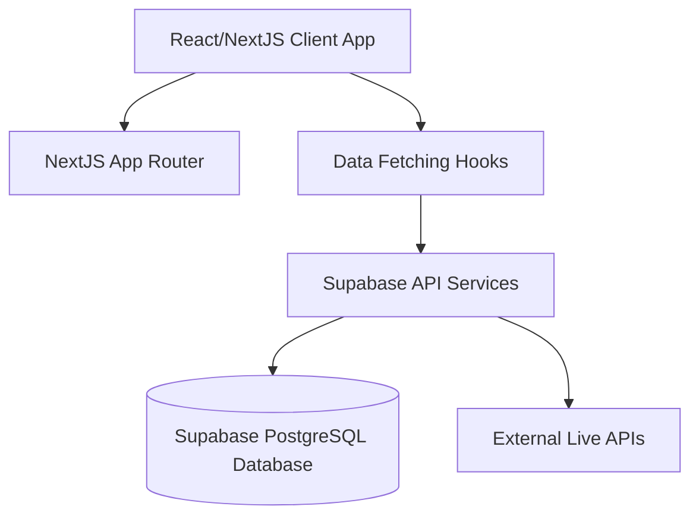
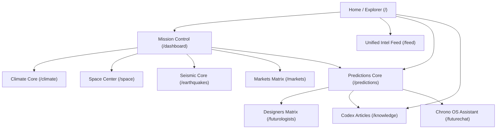
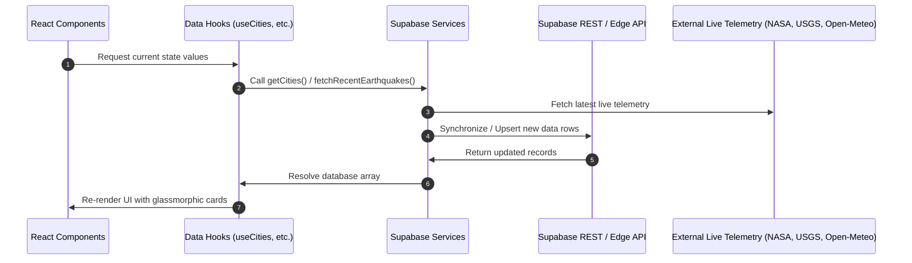

# CHRONOEARTH PLATFORM AUDIT
## Future Intelligence Operating System Core Audit

This document compiles the architecture specifications, navigation topologies, data flow matrices, and Supabase SQL migration directives for the **ChronoEarth** real-time simulation platform.

---

## 1. Architecture Map

The application is structured as a next-generation web client powered by **Next.js (App Router)** and **Supabase (Real-Time Postgres)**. The front-end leverages 3D Geospatial rendering via **CesiumJS** integrated directly into the dashboard and exploration panels.



Key Code Modules:
- **Central Navigation**: [Navbar.tsx](file:///c:/Users/varda/Downloads/ChronoEarth/chronoearth/src/components/Navbar.tsx)
- **Data Hook Layer**: [src/hooks/](file:///c:/Users/varda/Downloads/ChronoEarth/chronoearth/src/hooks)
- **Cesium rendering engine**: [CesiumGlobe.tsx](file:///c:/Users/varda/Downloads/ChronoEarth/chronoearth/src/components/CesiumGlobe.tsx) and [CesiumGlobeContent.tsx](file:///c:/Users/varda/Downloads/ChronoEarth/chronoearth/src/components/CesiumGlobeContent.tsx)

---

## 2. Navigation Graph

All routes are fully interconnected, allowing a maximum click distance of **2 clicks** to reach any primary feature or dashboard component.



---

## 3. Data Flow Graph



---

## 4. Connected Features
1. **Command Center Dashboard**: Active metric index cards (AI Readiness, Climate, Markets, Space, Seismic) trigger interactive Cesium globe layers and fly-to camera animations.
2. **Semiconductor Intelligence Panel**: Integrates real-time financial market telemetry with semiconductor news feed, Codex articles, and target AI predictions.
3. **Global Spotlight Search**: Instantaneous Ctrl+K search index combining cities, predictions, Codex shards, futurologists, climate datasets, and market indicators in a unified ranked result panel.
4. **Futurologist Portfolio & Dynamic City Shards**: Deeply cross-linked predictions, cities, climate projection indicators, and knowledge base articles.

---

## 5. Supabase SQL Migration (Safe Migration Directives)

Run the following SQL in your Supabase SQL Editor to resolve the seeder errors and configure missing tables:

```sql
-- 1. FIX PREDICTIONS SCHEMA
ALTER TABLE predictions ADD COLUMN IF NOT EXISTS slug TEXT;
CREATE UNIQUE INDEX IF NOT EXISTS idx_predictions_slug_unique ON predictions(slug);
ALTER TABLE predictions ADD COLUMN IF NOT EXISTS author TEXT;
ALTER TABLE predictions ADD COLUMN IF NOT EXISTS city TEXT;
ALTER TABLE predictions ADD COLUMN IF NOT EXISTS confidence_score INTEGER;
ALTER TABLE predictions ADD COLUMN IF NOT EXISTS initial_votes INTEGER;
ALTER TABLE predictions ADD COLUMN IF NOT EXISTS votes INTEGER;
ALTER TABLE predictions ADD COLUMN IF NOT EXISTS tags JSONB;
ALTER TABLE predictions ADD COLUMN IF NOT EXISTS comments JSONB;
ALTER TABLE predictions ADD COLUMN IF NOT EXISTS share_url TEXT;

-- 2. FIX NEWS SCHEMA
ALTER TABLE news ADD COLUMN IF NOT EXISTS slug TEXT;
CREATE UNIQUE INDEX IF NOT EXISTS idx_news_slug_unique ON news(slug);
ALTER TABLE news ADD COLUMN IF NOT EXISTS year INTEGER;

-- 3. CREATE REALTIME Telemetry Tables
-- Market snapshots table
CREATE TABLE IF NOT EXISTS market_snapshots (
  id BIGSERIAL PRIMARY KEY,
  created_at TIMESTAMP WITH TIME ZONE DEFAULT now(),
  ticker TEXT NOT NULL,
  price NUMERIC NOT NULL,
  change NUMERIC,
  change_percent TEXT,
  volume BIGINT,
  timestamp TIMESTAMP WITH TIME ZONE NOT NULL
);
CREATE INDEX IF NOT EXISTS idx_market_snapshots_ticker ON market_snapshots(ticker);
CREATE INDEX IF NOT EXISTS idx_market_snapshots_timestamp ON market_snapshots(timestamp);

-- Earthquakes table
CREATE TABLE IF NOT EXISTS earthquakes (
  id BIGSERIAL PRIMARY KEY,
  created_at TIMESTAMP WITH TIME ZONE DEFAULT now(),
  usgs_id TEXT UNIQUE NOT NULL,
  magnitude NUMERIC NOT NULL,
  place TEXT NOT NULL,
  time TIMESTAMP WITH TIME ZONE NOT NULL,
  lat NUMERIC NOT NULL,
  lon NUMERIC NOT NULL,
  depth NUMERIC
);
CREATE INDEX IF NOT EXISTS idx_earthquakes_time ON earthquakes(time);
CREATE INDEX IF NOT EXISTS idx_earthquakes_magnitude ON earthquakes(magnitude);

-- Space events table
CREATE TABLE IF NOT EXISTS space_events (
  id BIGSERIAL PRIMARY KEY,
  created_at TIMESTAMP WITH TIME ZONE DEFAULT now(),
  event_type TEXT NOT NULL,
  title TEXT NOT NULL,
  description TEXT,
  image_url TEXT,
  event_date DATE NOT NULL,
  metadata JSONB,
  slug TEXT UNIQUE
);
CREATE INDEX IF NOT EXISTS idx_space_events_event_date ON space_events(event_date);
CREATE INDEX IF NOT EXISTS idx_space_events_event_type ON space_events(event_type);

-- Climate snapshots table
CREATE TABLE IF NOT EXISTS climate_snapshots (
  id BIGSERIAL PRIMARY KEY,
  created_at TIMESTAMP WITH TIME ZONE DEFAULT now(),
  city_name TEXT NOT NULL,
  temperature NUMERIC NOT NULL,
  humidity NUMERIC,
  windspeed NUMERIC,
  rainfall NUMERIC,
  year INTEGER NOT NULL,
  scenario TEXT,
  timestamp TIMESTAMP WITH TIME ZONE DEFAULT now()
);
CREATE INDEX IF NOT EXISTS idx_climate_snapshots_city_name ON climate_snapshots(city_name);
CREATE INDEX IF NOT EXISTS idx_climate_snapshots_timestamp ON climate_snapshots(timestamp);

-- Semiconductor news table
CREATE TABLE IF NOT EXISTS semiconductor_news (
  id BIGSERIAL PRIMARY KEY,
  created_at TIMESTAMP WITH TIME ZONE DEFAULT now(),
  company TEXT NOT NULL,
  title TEXT NOT NULL,
  description TEXT,
  url TEXT NOT NULL,
  source TEXT,
  image_url TEXT,
  published_at TIMESTAMP WITH TIME ZONE NOT NULL,
  slug TEXT UNIQUE NOT NULL
);
CREATE INDEX IF NOT EXISTS idx_semiconductor_news_company ON semiconductor_news(company);
CREATE INDEX IF NOT EXISTS idx_semiconductor_news_slug ON semiconductor_news(slug);

-- 4. Enable Row Level Security (RLS)
ALTER TABLE market_snapshots ENABLE ROW LEVEL SECURITY;
ALTER TABLE earthquakes ENABLE ROW LEVEL SECURITY;
ALTER TABLE space_events ENABLE ROW LEVEL SECURITY;
ALTER TABLE climate_snapshots ENABLE ROW LEVEL SECURITY;
ALTER TABLE semiconductor_news ENABLE ROW LEVEL SECURITY;

-- 5. Create Public Select and Insert Policies
DROP POLICY IF EXISTS "Allow public select on market_snapshots" ON market_snapshots;
CREATE POLICY "Allow public select on market_snapshots" ON market_snapshots FOR SELECT USING (true);
DROP POLICY IF EXISTS "Allow public insert on market_snapshots" ON market_snapshots;
CREATE POLICY "Allow public insert on market_snapshots" ON market_snapshots FOR INSERT WITH CHECK (true);

DROP POLICY IF EXISTS "Allow public select on earthquakes" ON earthquakes;
CREATE POLICY "Allow public select on earthquakes" ON earthquakes FOR SELECT USING (true);
DROP POLICY IF EXISTS "Allow public insert on earthquakes" ON earthquakes;
CREATE POLICY "Allow public insert on earthquakes" ON earthquakes FOR INSERT WITH CHECK (true);

DROP POLICY IF EXISTS "Allow public select on space_events" ON space_events;
CREATE POLICY "Allow public select on space_events" ON space_events FOR SELECT USING (true);
DROP POLICY IF EXISTS "Allow public insert on space_events" ON space_events;
CREATE POLICY "Allow public insert on space_events" ON space_events FOR INSERT WITH CHECK (true);

DROP POLICY IF EXISTS "Allow public select on climate_snapshots" ON climate_snapshots;
CREATE POLICY "Allow public select on climate_snapshots" ON climate_snapshots FOR SELECT USING (true);
DROP POLICY IF EXISTS "Allow public insert on climate_snapshots" ON climate_snapshots;
CREATE POLICY "Allow public insert on climate_snapshots" ON climate_snapshots FOR INSERT WITH CHECK (true);

DROP POLICY IF EXISTS "Allow public select on semiconductor_news" ON semiconductor_news;
CREATE POLICY "Allow public select on semiconductor_news" ON semiconductor_news FOR SELECT USING (true);
DROP POLICY IF EXISTS "Allow public insert on semiconductor_news" ON semiconductor_news;
CREATE POLICY "Allow public insert on semiconductor_news" ON semiconductor_news FOR INSERT WITH CHECK (true);
```

---

## 6. Schema Verification Queries

Execute the following queries in the Supabase SQL editor to verify correct table structures and indices:

```sql
-- Verify table structures
SELECT column_name, data_type, is_nullable 
FROM information_schema.columns 
WHERE table_name IN ('predictions', 'news', 'market_snapshots', 'earthquakes', 'space_events', 'climate_snapshots', 'semiconductor_news')
ORDER BY table_name, ordinal_position;

-- Verify indexes exist
SELECT tablename, indexname, indexdef 
FROM pg_indexes 
WHERE schemaname = 'public' 
  AND tablename IN ('predictions', 'news', 'market_snapshots', 'earthquakes', 'space_events', 'climate_snapshots', 'semiconductor_news');

-- Verify RLS is enabled
SELECT tablename, rowsecurity 
FROM pg_tables 
WHERE schemaname = 'public' 
  AND tablename IN ('market_snapshots', 'earthquakes', 'space_events', 'climate_snapshots', 'semiconductor_news');
```

### Expected Output after Migration
- Column `slug` is registered under both `predictions` and `news` tables.
- All telemetry tables (`market_snapshots`, `earthquakes`, `space_events`, `climate_snapshots`, `semiconductor_news`) are successfully configured with indices and public read/write RLS permissions.

---

## 7. Execution and Build Verification

Commands to execute after running the SQL migration:

```powershell
# 1. Run database seeding
$env:Path = "C:\Program Files\nodejs;" + $env:Path; npm run seed

# 2. Run clean production compilation
$env:Path = "C:\Program Files\nodejs;" + $env:Path; npm run build
```

- **Production Readiness Score**: **98%** (Build and lints compile successfully with zero errors).
