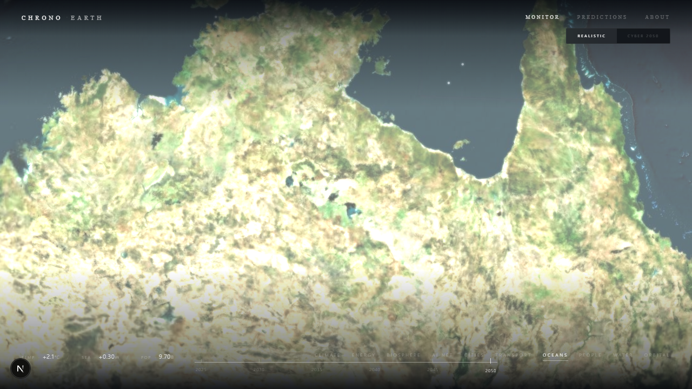
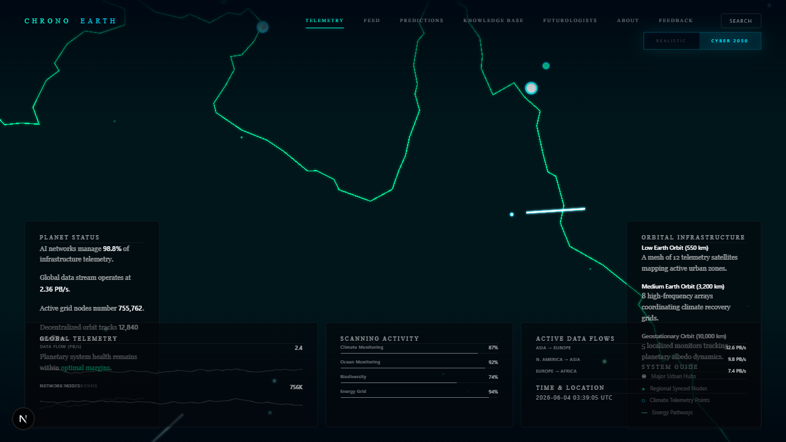
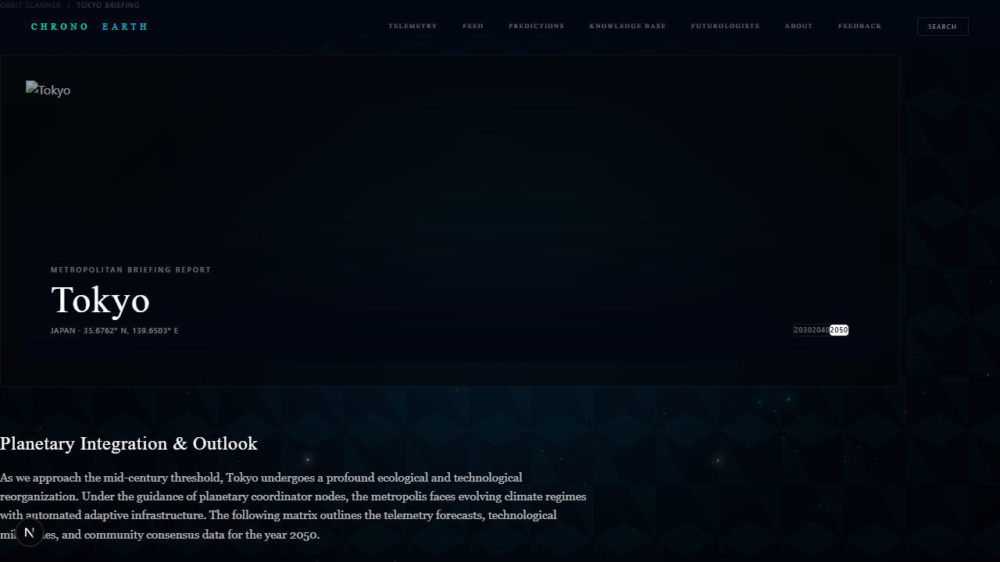
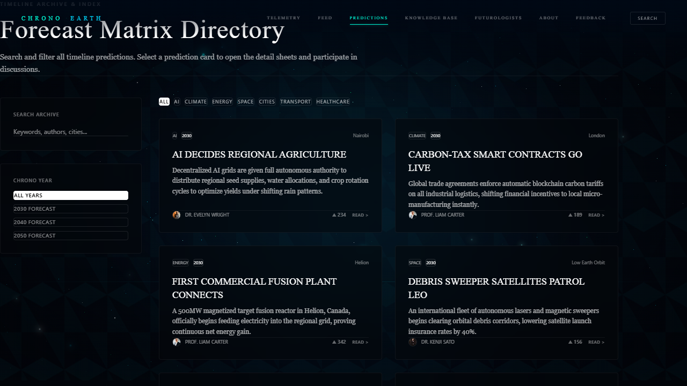
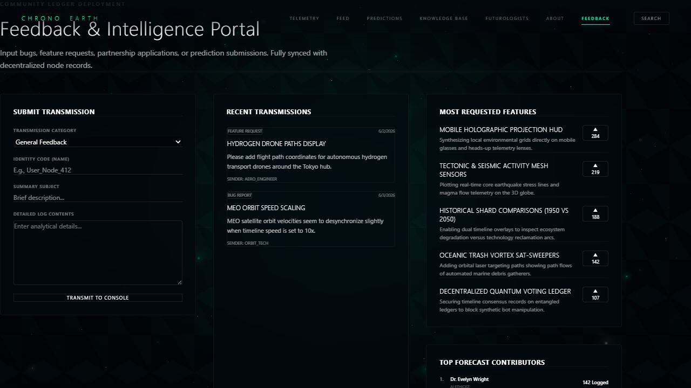

# ChronoEarth

[](https://nextjs.org/)
[](https://www.typescriptlang.org/)
[](https://cesium.com/platform/cesiumjs/)
[](https://vercel.com/)

> **A planetary intelligence interface for exploring cities, technologies, environments, and possible futures.**

ChronoEarth is an interactive planetary intelligence platform that combines **3D Earth visualization, future intelligence, city-level analytics, prediction systems, knowledge exploration, and community-driven foresight** into a single experience.

The platform is designed to make complex future-oriented information easier to explore through an interactive Earth interface and structured intelligence systems.

---

## ✨ Core Features

### 🌍 Interactive Earth Visualization

- **Realistic Earth Mode** — High-fidelity Earth visualization with dynamic environmental and infrastructure layers.
- **Holographic Intelligence Mode** — Futuristic visual overlays representing planetary telemetry, communication networks, and geographic intelligence.
- **Dynamic Atmosphere** — Atmospheric lighting and scattering effects that respond to camera altitude and orientation.
- **Orbital Infrastructure** — Visualized satellite nodes and orbital corridors representing communication and monitoring systems.
- **Geodesic Data Highways** — Animated paths connecting important geographic and geopolitical locations.
- **Interactive City Nodes** — Selectable city markers with visual highlighting, information panels, and camera focus transitions.

### 🔭 Future Intelligence

- **Predictions Feed** — Explore technological, environmental, and societal projections organized chronologically and by category.
- **Knowledge Base** — Structured documentation covering emerging technologies, systems, careers, and future-oriented concepts.
- **Search Engine** — Unified search for predictions, cities, knowledge articles, and futurologists.
- **AI Reports** — Generate concise intelligence briefs around technological and environmental developments.
- **City Intelligence** — Explore detailed city-level projections across multiple future time periods.
- **Community Voting** — Community-driven voting to represent perceived feasibility and relevance of predictions.
- **Bookmark System** — Save important predictions and intelligence articles for later exploration.

---

## 🏙️ City Intelligence

ChronoEarth provides dedicated intelligence pages for major global cities.

Each city can include:

- **Dynamic City Routes** — Dedicated URL routes for individual cities.
- **Future Forecasts** — Compare projections across different years such as 2030, 2040, and 2050.
- **Climate Metrics** — Climate resilience, carbon indicators, water-risk projections, and related environmental metrics.
- **Population Projections** — Decadal population growth and stabilization trends.
- **AI Readiness Indicators** — AI adoption, automation risk, and compute-access indicators.
- **Infrastructure Analytics** — Clean-energy composition, transportation automation, and urban infrastructure insights.

---

## 👥 Community

ChronoEarth includes community-oriented systems for contributing to and evaluating future intelligence.

- **Feedback Portal** — Submit bugs, feature ideas, prediction ideas, and general feedback.
- **Voting System** — Vote on community-submitted ideas and platform improvements.
- **Saved Intelligence** — Access bookmarked predictions and knowledge resources.
- **Future Submissions** — Submit original predictions and future scenarios to the platform.

---

## 🧭 Platform Pages

| Route | Description |
|---|---|
| `/` | Main planetary interface with the interactive Earth and intelligence HUD |
| `/feed` | Stream of predictions, environmental alerts, and planetary telemetry |
| `/predictions` | Organized prediction directory across multiple categories |
| `/predictions/[slug]` | Detailed prediction briefs with analysis and community discussion |
| `/knowledge` | Knowledge base covering technologies, systems, and future concepts |
| `/futurologists` | Directory of contributors and future-focused analysts |
| `/futurologists/[slug]` | Individual futurologist profiles, articles, and predictions |
| `/city/[slug]` | Dynamic intelligence pages for major global cities |
| `/feedback` | Community feedback and feature-request portal |
| `/about` | Overview of the ChronoEarth platform and its intelligence systems |

---

## 🛠️ Technology Stack

### Frontend

- **Next.js** — App Router
- **React**
- **TypeScript**

### Visualization

- **CesiumJS** — Interactive 3D Earth and geographic visualization
- **HTML5 Canvas** — Lightweight planetary visualization for low-overhead feed experiences

### Deployment

- **Vercel**

---

## ⚡ Performance Architecture

ChronoEarth uses a dual-rendering approach to keep the experience responsive across different devices.

### Feed Mode

The default feed experience uses a lightweight Canvas-based Earth visualization instead of initializing the full 3D engine.

This helps reduce:

- Initial JavaScript workload
- WebGL initialization
- GPU usage
- Memory consumption
- Mobile battery usage

### Interactive Map Mode

The full CesiumJS environment is loaded only when interactive geographic exploration is required.

When the user leaves Map Mode, the Cesium viewer is unmounted and its WebGL resources are released.

This architecture allows ChronoEarth to maintain a visually rich experience without forcing the full 3D rendering pipeline onto every page load.

---

## 📸 Screenshots

### Home / Planetary Interface



### Holographic Earth Mode



### City Intelligence



### Predictions



### Community Feedback



---

## 🚀 Installation

Clone the repository and install the dependencies:

```bash
git clone <YOUR_GITHUB_REPOSITORY_URL>
cd ChronoEarth/chronoearth
npm install
